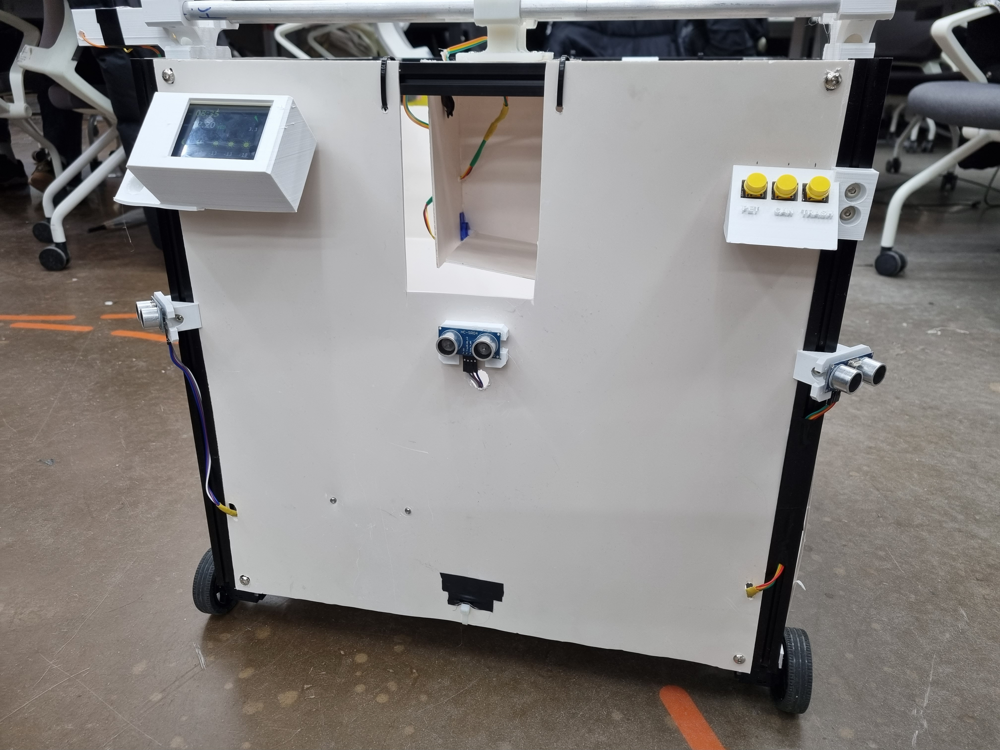
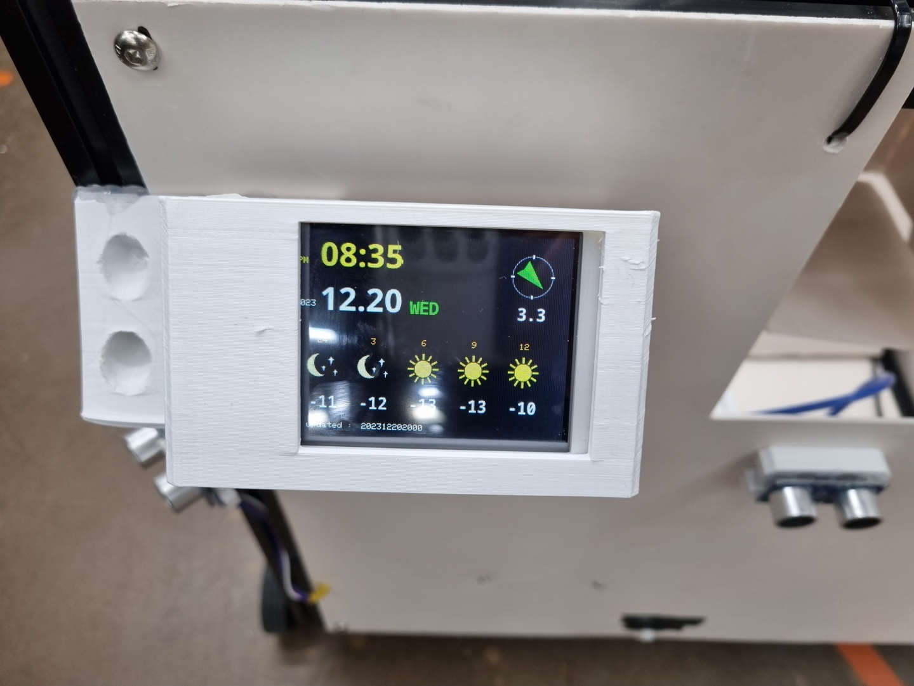
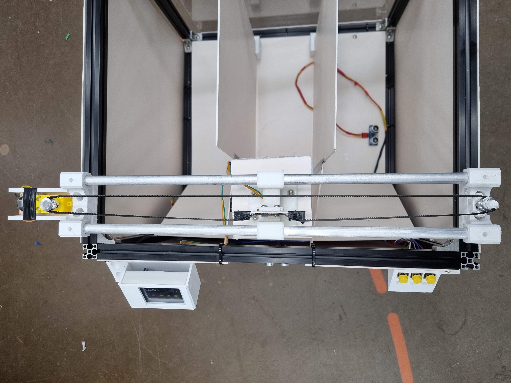
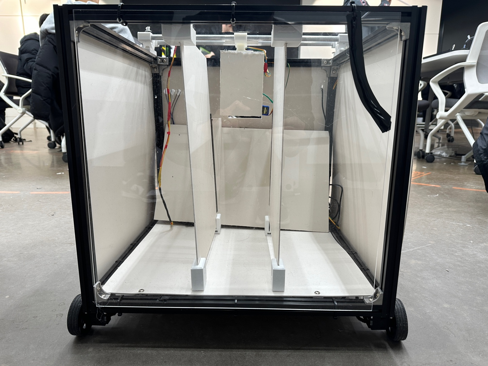
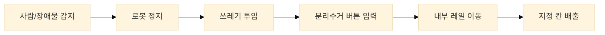

# 어드벤쳐디자인1 - 자율주행 분리수거 쓰레기통

광장, 역 등 유동 인구가 많은 공간을 대상으로 한 이동형 분리수거 쓰레기통 제작 프로젝트

## 개요

- DYNAMIXEL 모터 기반 이동 플랫폼
- 초음파 센서 기반 사람 및 장애물 감지
- Raspberry Pi 카메라 기반 ArUco Marker 인식
- 버튼 입력 기반 내부 레일 이동 및 하단 개폐식 배출 구조
- 후면 아크릴 구조와 미니 디스플레이 기반 상태 확인

## 전체 구조

### 이동 플랫폼과 외부 프레임

  

### 전면 수거부와 센서 배치

  

## 분리수거 구조

### 내부 레일과 분리수거 공간

  

### 미니 디스플레이와 초음파 센서

  

## 동작 흐름

